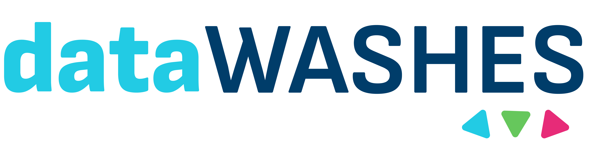

<p align="center">
    
</p>

# Motivation
Given the importance of the Workshop on Social, Human, and Economic Aspects of Software (WASHES) in the Brazilian SE research landscape, there is a compelling opportunity to work towards an open infrastructure to streamline access to its data. With the symbolic upcoming 10th edition in 2025 and a substantial archive of published papers, spanning various topics and authored by researchers from diverse backgrounds and regions across Brazil, there is immense potential for facilitating programmatic access to this valuable resource. Currently, the [WASHES proceedings](https://sol.sbc.org.br/index.php/washes) are openly available and well-maintained through SBC OpenLib (SOL - https://sol.sbc.org.br), albeit with manual access only. In this sense, this manual retrieval process can be inefficient, especially for those seeking to conduct secondary studies or robust analyses on WASHES data. To address this gap, developing an open infrastructure tailored for WASHES data would be beneficial, especially being something made by the community for the community.

# Proposal
Therefore, we present **dataWASHES**: a public, academic, and open source Application Programming Interface (API) designed to streamline the programmatic process of gathering data from the WASHES proceedings open available at SOL. Hence, by introducing our API, in the form of open infrastructure, we aim to provide the community with a convenient tool for systematically and programmatically accessing data (papers, authors, and editions) from the proceedings, thereby enhancing openness, usefulness, and efficiency.

The development of this project is a collaborative, open-source and non-profit action, currently under [MIT License](https://opensource.org/license/mit).

## Install
1. Clone the repository to your computer:
```shell
git clone https://github.com/gesid/dataWASHES.git
```

2. Create and activate a virtual environment (optional, but recommended):
```shell
python -m venv .venv
source .venv/bin/activate  # Linux/Mac
.venv\Scripts\activate      # Windows (cmd)
.venv\Scripts\Activate.ps1      # Windows (powershell)
```

3. Install dependencies:
```shell
pip install -r requirements.txt
```

## Usage
1. Start the server:
```shell
python src\app.py # Windows
python src/app.py # Linux/Mac
```

2. Visit the API documentation at http://localhost:5000/ for details on available endpoints and how to use them.

# References
The WASHES proceedings are openly available and well-maintained through SBC OpenLib ([SOL](https://sol.sbc.org.br)). Currently, all documents published in [SOL](https://sol.sbc.org.br/index.php/indice/faq)  are made available under the [Creative Commons license (CC BY 4.0)](https://creativecommons.org/licenses/by/4.0/deed.en), allowing for copying and redistribution of the material in any medium or format for any purpose.
