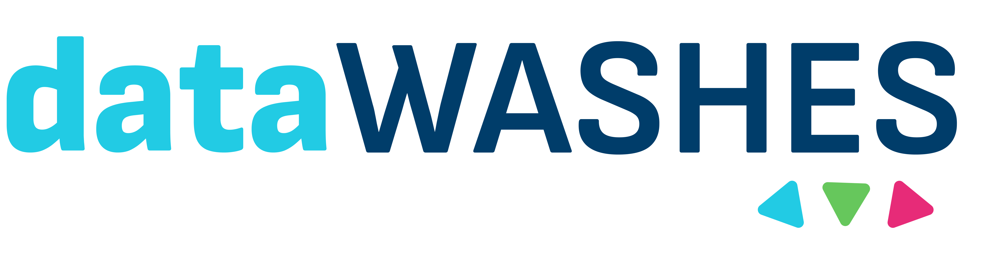

<p align="center">
    

    https://gesid.github.io/dataWASHES
</p>

# Motivation
Given the importance of the Workshop on Social, Human, and Economic Aspects of Software (WASHES) in the Brazilian SE research landscape, there is a compelling opportunity to work towards an open infrastructure to streamline access to its data. With over a decade of history and a substantial archive of published papers spanning various topics and authored by researchers from diverse backgrounds and regions across Brazil, there is immense potential for facilitating programmatic access to this valuable resource. Currently, the [WASHES proceedings](https://sol.sbc.org.br/index.php/washes) are openly available and well-maintained through SBC OpenLib (SOL - https://sol.sbc.org.br), albeit with manual access only. In this sense, this manual retrieval process can be inefficient, especially for those seeking to conduct secondary studies or robust analyses on WASHES data. To address this gap, developing an open infrastructure tailored for WASHES data would be beneficial, especially being something made by the community for the community.

# Proposal
Therefore, we present **dataWASHES**: a public, academic, and open source Application Programming Interface (API) designed to streamline the programmatic process of gathering data from the WASHES proceedings openly available at SOL. By introducing our API in the form of an open infrastructure, we aim to provide the community with a convenient tool for systematically and programmatically accessing data (papers, authors, and editions) from the proceedings, thereby enhancing openness, usefulness, and efficiency.

## 📊 Current Coverage

| Metric | Value |
|---|---|
| **Editions** | 11 (2016 – 2026) |
| **Published papers** | 138 |
| **Participating authors** | 430+ |

## 🤖 Fully Autonomous Dataset

The dataset is maintained **autonomously** through a modern CI/CD pipeline integrated with GitHub Actions, which combines:

- **Automated Web Scraping** of the official WASHES proceedings at SOL SBC;
- **AI-driven methodological classification** using Large Language Models (**Groq LLM — Llama-3.3 70B**), which reads each paper's abstract and fills in the six methodological fields;
- **Citation mining** from Google Scholar via **ScraperAPI**, keeping the `Cited_by` metrics up to date.

Every month, the pipeline runs on its own, regenerates the JSON datasets, and opens a Pull Request for maintainer review — no manual data entry required. See the [Data Update Guide](docs/maintenance/update-data.md) for the full architecture.

The development of this project is a collaborative, open-source and non-profit action, currently under [MIT License](https://opensource.org/license/mit). Check out our [paper](https://sol.sbc.org.br/index.php/washes/article/view/29451) with preliminary results published at WASHES 2024.

See our [video]() for a brief tutorial/demonstration.

## Install
1. Clone the repository to your computer:
```shell
git clone https://github.com/gesid/dataWASHES.git
```

2. Create and activate a virtual environment (optional, but recommended):
```shell
python -m venv .venv
source .venv/bin/activate       # Linux/Mac
.venv\Scripts\activate          # Windows (cmd)
.venv\Scripts\Activate.ps1      # Windows (powershell)
```

3. Install dependencies:
```shell
pip install -r requirements.txt
```

## Usage
1. Start the server:
```shell
python src/app.py
```

2. Visit the API documentation at http://localhost:5000/ for details on available endpoints and how to use them.

## Running Tests
To ensure everything is working correctly, you can run the automated test suite. We use `pytest` with Flask's test client running fully **in-memory** (28 automated tests, no server or external services required):
```shell
pytest
```

## Maintenance & Deployment
- 🔄 [Data Update Guide](docs/maintenance/update-data.md) — how the autonomous ingestion pipeline (scraping + AI + citations) works and how to review the automatic Pull Requests.
- 🚀 [Hosting & Deploy Guide](docs/maintenance/deploy.md) — automated deployment to PythonAnywhere via GitHub Actions and the monthly hosting auto-renewal bot.

# References
The WASHES proceedings are openly available and well-maintained through SBC OpenLib ([SOL](https://sol.sbc.org.br)). Currently, all documents published in [SOL](https://sol.sbc.org.br/index.php/indice/faq) are made available under the [Creative Commons license (CC BY 4.0)](https://creativecommons.org/licenses/by/4.0/deed.en), allowing for copying and redistribution of the material in any medium or format for any purpose.