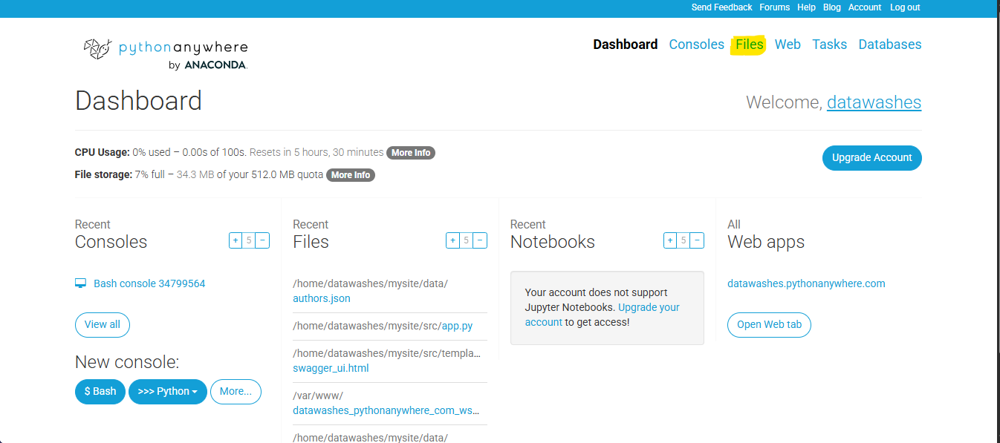
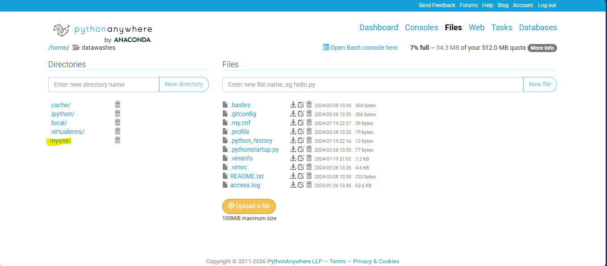
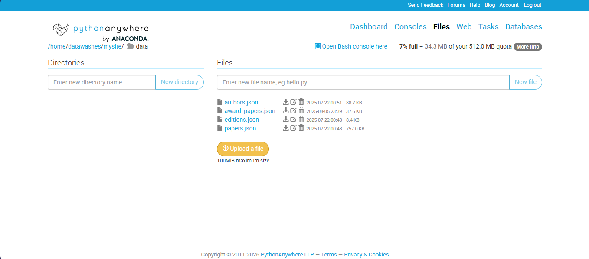
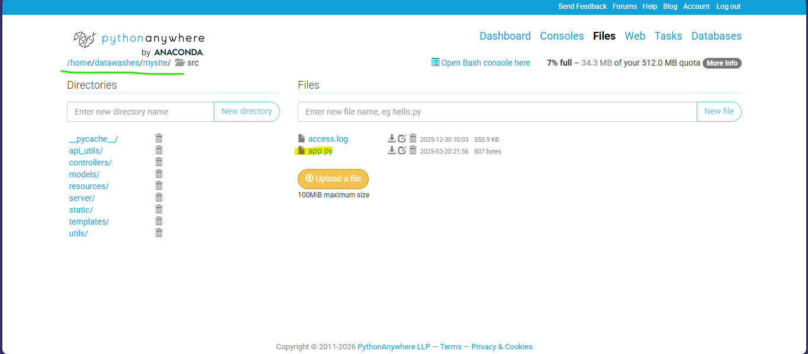
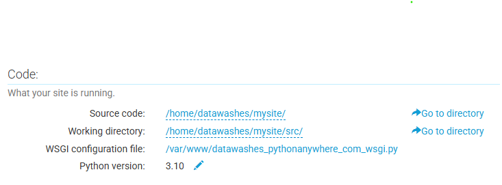
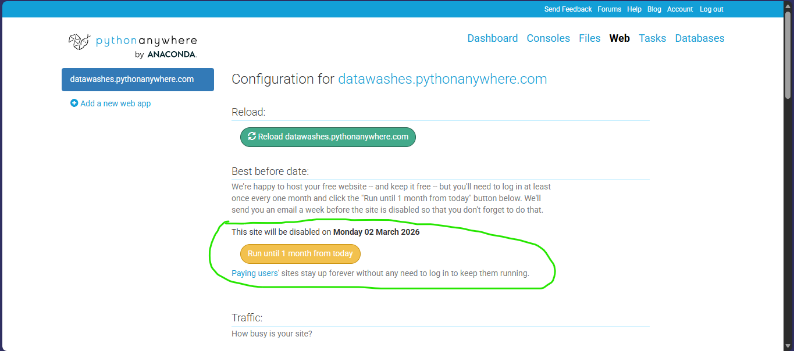

# Deploy no PythonAnywhere

Após realizar o login com a conta do **dataWASHES**, o processo de deploy das mudanças é relativamente simples.  
A interface inicial do PythonAnywhere é mostrada abaixo. Para realizar qualquer modificação nos arquivos do projeto, clique na opção **"Files"**, localizada no canto superior direito.



## Estrutura dos arquivos no servidor

Nesta seção são exibidos todos os arquivos do projeto que estão hospedados no servidor.  
Os arquivos do dataWASHES encontram-se no diretório `/mysite`. Ao acessar esse diretório, você verá as pastas `/src` e `/data`, que são equivalentes aos diretórios de mesmo nome existentes no projeto local.

- **/src**: contém o código-fonte da aplicação (API, controllers, configurações etc.).
- **/data**: contém os arquivos JSON utilizados como base de dados do sistema.

Sempre que houver **novos dados** ou **alterações no código**, é necessário atualizar no servidor **todos os arquivos que foram modificados localmente**.



## Atualizando arquivos no PythonAnywhere

Para atualizar um arquivo, utilize a opção **"Upload a file"**, destacada em laranja na interface.

1. Clique em **"Upload a file"**;
2. Selecione o arquivo novo ou modificado em seu computador;
3. Certifique-se de que o arquivo possui **exatamente o mesmo nome** do arquivo já existente no servidor.

Ao realizar o upload, o PythonAnywhere **substitui automaticamente** o arquivo antigo pelo novo.



> ⚠️ **Atenção:** Caso o nome do arquivo seja diferente, o sistema criará um novo arquivo em vez de substituir o existente, o que pode causar erros na aplicação.

## Diferença entre o projeto local e o projeto hospedado

Ao navegar até o arquivo `src/app.py`, é possível notar algumas diferenças entre a versão local e a versão hospedada no PythonAnywhere.



A versão hospedada do arquivo é a seguinte:

```python
from flask import make_response, render_template
from controllers import authors_ns, editions_ns, papers_ns, statistics_ns
from server import server
from api_utils import convert_to_csv
from resources import StatisticsCalc


def main() -> None:
    server.api.add_namespace(editions_ns)
    server.api.add_namespace(papers_ns)
    server.api.add_namespace(authors_ns)
    # server.api.add_namespace(statistics_ns)
    # server.run() 


[...]

if __name__ == '__main__':
    main()
```

A principal diferença está na **função de entrada da aplicação**.

- **Execução local**:  
  Para rodar o projeto localmente, a função `server.run()` deve ser chamada dentro da função `main()`, pois é ela que inicia o servidor Flask.

- **Execução no PythonAnywhere**:  
  No ambiente hospedado, a chamada `server.run()` **deve permanecer comentada**, pois o próprio PythonAnywhere é responsável por iniciar e gerenciar a execução da aplicação.

Essa separação evita conflitos entre o servidor Flask local e o servidor WSGI utilizado pelo PythonAnywhere.

## Configuração WSGI

A execução da aplicação no PythonAnywhere é configurada por meio do arquivo **WSGI configuration file**, que pode ser acessado pela aba **Web** no painel do PythonAnywhere.



O conteúdo do arquivo é semelhante ao seguinte:

```python
# This file contains the WSGI configuration required to serve up your
# web application at http://<your-username>.pythonanywhere.com/

import sys

# Adiciona o diretório do projeto ao sys.path
project_home = '/home/datawashes/mysite'
if project_home not in sys.path:
    sys.path = [project_home] + sys.path

# Importa a aplicação Flask
from src import app
app.main()
application = app.server.app  # noqa
```

Nesse arquivo:

- O diretório do projeto é adicionado ao `sys.path`, permitindo que os módulos sejam corretamente importados;
- A função `main()` é chamada para registrar os *namespaces* da API;
- A variável `application` expõe a aplicação Flask para o servidor WSGI, permitindo que o PythonAnywhere a execute corretamente.

Após atualizar os arquivos e, se necessário, o arquivo WSGI, **lembre-se de recarregar a aplicação** na aba **Web**, para que as mudanças entrem em vigor.

## Importante

A versão gratuita do pythonAnywhere deixar a aplicação rodando por 1 mês. Depos desse período, para manter o sistema no ar é necessário acessar o sistema e atualizar o período de deploy.


