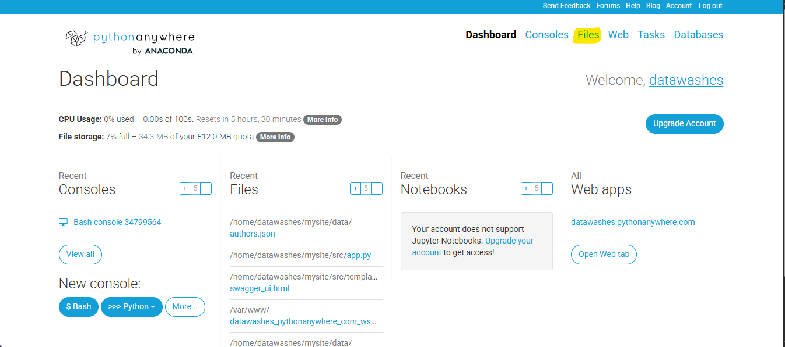
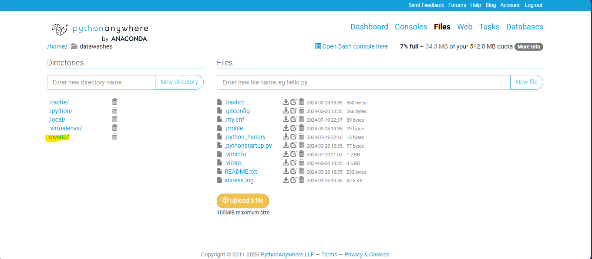
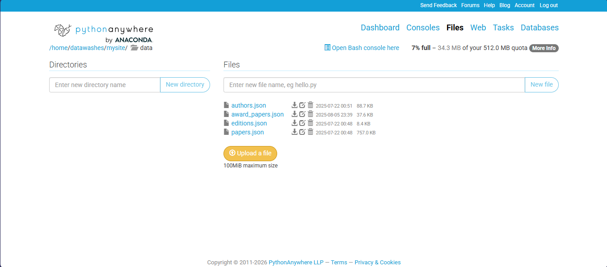
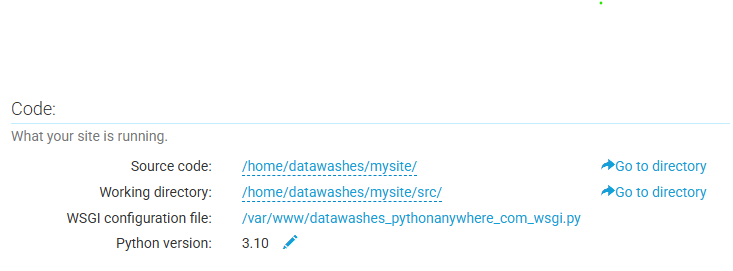
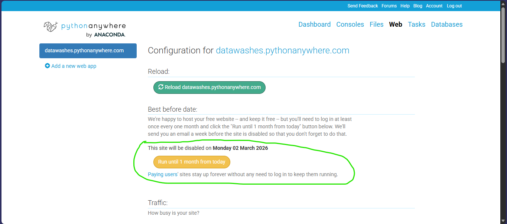

# Deploy no PythonAnywhere

### ⚠️ Pré-requisito: Credenciais de Produção
Atualmente, o deploy é realizado de forma manual diretamente no painel do servidor. Para realizar esta etapa, você precisará:
1. Solicitar o **Usuário e Senha** da conta PythonAnywhere do dataWASHES com o administrador do projeto.
2. Garantir que os arquivos JSON gerados na sua máquina local (passos descritos em `update-data.md`) estejam devidamente validados antes de subí-los para produção.

---

Após realizar o login com a conta oficial do **dataWASHES**, o processo de deploy das mudanças é feito através da interface web do PythonAnywhere. Para realizar qualquer modificação nos arquivos do projeto, clique na opção **"Files"**, localizada no canto superior direito.



## Estrutura dos arquivos no servidor

Os arquivos do dataWASHES encontram-se no diretório `/mysite`. Ao acessar esse diretório, você verá as pastas `/src` e `/data`, que são equivalentes aos diretórios de mesmo nome existentes no projeto local.

- **/src**: contém o código-fonte da aplicação (API, controllers, configurações etc.).
- **/data**: contém os arquivos JSON utilizados como base de dados do sistema.

Sempre que houver **novos dados** (atualização anual) ou **alterações no código**, é necessário atualizar no servidor todos os arquivos que foram modificados localmente.



## Atualizando arquivos no PythonAnywhere

Para atualizar um arquivo, utilize a opção **"Upload a file"**, destacada em laranja na interface.

1. Navegue até a pasta correta (ex: `/mysite/data/` para os JSONs ou `/mysite/src/` para scripts);
2. Clique em **"Upload a file"**;
3. Selecione o arquivo novo ou modificado em seu computador;
4. Certifique-se de que o arquivo possui **exatamente o mesmo nome** do arquivo já existente no servidor.

Ao realizar o upload, o PythonAnywhere **substitui automaticamente** o arquivo antigo pelo novo.



> ⚠️ **Atenção:** Caso o nome do arquivo seja diferente, o sistema criará um novo arquivo em vez de substituir o existente, o que impedirá a aplicação de ler os novos dados.

## Diferença entre o projeto local e o projeto hospedado

Ao navegar até o arquivo `src/app.py`, é possível notar uma diferença fundamental entre a versão que roda no seu computador e a versão que deve ficar no servidor.

A estrutura do arquivo é a seguinte:

```python
def main() -> None:
    server.api.add_namespace(editions_ns)
    server.api.add_namespace(papers_ns)
    server.api.add_namespace(authors_ns)
    server.api.add_namespace(statistics_ns)
    server.run()  # Essa linha deve ser comentada ao realizar o deploy do projeto

[...]

if __name__ == '__main__':
    main()
```

### O ajuste obrigatório no `app.py`:

- **Execução local**: Para rodar o projeto no seu computador, a função `server.run()` deve estar ativa (sem o `#`), pois ela inicia o servidor Flask.
- **Execução no PythonAnywhere**: No ambiente hospedado, a chamada `server.run()` **deve obrigatoriamente estar comentada** (com o `#` na frente).

Isso ocorre porque o PythonAnywhere utiliza um servidor interno (WSGI) que gerencia a inicialização da API. Se a linha não for comentada, a aplicação tentará iniciar um servidor dentro de outro, gerando um erro crítico que deixará a API fora do ar.

## Configuração WSGI

A execução da aplicação é gerenciada pelo arquivo **WSGI configuration file**, acessível pela aba **Web** no painel do PythonAnywhere.



O conteúdo deste arquivo vincula o diretório `/mysite` à execução do Flask:

```python
import sys

# Adiciona o diretório do projeto ao sys.path
project_home = '/home/datawashes/mysite'
if project_home not in sys.path:
    sys.path = [project_home] + sys.path

# Importa a aplicação Flask
from src import app
app.main()
application = app.server.app  # noqa
```

> 🔄 **Passo Final Crucial:** Após atualizar qualquer arquivo (JSON ou código), você **deve** acessar a aba **Web** no painel do PythonAnywhere e clicar no botão verde **"Reload datawashes.pythonanywhere.com"**. 
>
> Esse procedimento é obrigatório porque o servidor precisa reiniciar para ler os novos arquivos JSON e carregar as alterações no código Python. Sem o *Reload*, a API continuará exibindo os dados antigos.

## Importante: Expiração da conta

A versão gratuita do PythonAnywhere mantém a aplicação ativa por **1 mês**. Após esse prazo, a API sairá do ar automaticamente. Para evitar isso, um administrador deve acessar o painel mensalmente e clicar no botão para estender o período de deploy (botão "Run until X").


