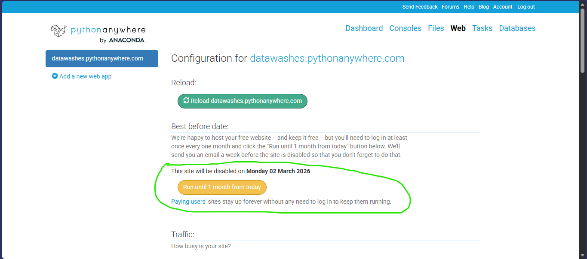

# 🚀 Deploy no PythonAnywhere

O **dataWASHES** está hospedado na plataforma PythonAnywhere e todo o ciclo de vida da hospedagem é **100% automatizado via GitHub Actions**: o deploy em produção acontece sozinho a cada merge na `main`, e um robô de navegação renova a hospedagem gratuita mensalmente — sem uploads manuais, sem consoles e sem cliques.

---

## ⚡ Deploy Automatizado (`.github/workflows/deploy.yml`)

Sempre que um Pull Request é aprovado (ou qualquer commit chega à branch `main`), o workflow [`deploy.yml`](../../.github/workflows/deploy.yml) é disparado automaticamente e executa duas chamadas à **API do PythonAnywhere**, autenticadas com o token secreto `PYTHONANYWHERE_API_TOKEN`:

1. **`git pull origin main`:** envia o comando `cd /home/datawashes/mysite && git pull origin main` para o console remoto do PythonAnywhere (`/consoles/<id>/send_input/`), sincronizando o servidor com o repositório GitHub — que é a fonte única da verdade.
2. **Reload da aplicação:** dispara `POST /webapps/datawashes.pythonanywhere.com/reload/`, reiniciando a aplicação web para que os novos arquivos JSON da pasta `data/` e o código de `src/` entrem no ar imediatamente.

> Ou seja: **aprovou o PR → produção atualizada em segundos.** Não é necessário acessar o painel do PythonAnywhere.

### 🛠️ Configuração WSGI (Referência)

A execução da aplicação é gerenciada pelo arquivo **WSGI configuration file** (acessível pela aba **Web**). O conteúdo deste arquivo vincula o diretório `/mysite` à execução do Flask:

```python
import sys

# Adiciona o diretório do projeto ao sys.path
project_home = '/home/datawashes/mysite'
if project_home not in sys.path:
    sys.path = [project_home] + sys.path

# Importa a aplicação Flask e inicializa as rotas
from src import app
app.main()
application = app.server.app  # noqa
```

*(Nota: O código em `src/app.py` possui uma estrutura inteligente com `if __name__ == '__main__':` que impede o conflito entre o servidor de desenvolvimento local e o servidor WSGI de produção).*

---

## 🤖 Robô de Renovação Mensal da Hospedagem (`renew-hosting.yml`)

A versão gratuita do PythonAnywhere mantém a aplicação ativa por ciclos de **30 dias**. Após esse prazo, a API sairia do ar automaticamente.

Para eliminar esse risco, o projeto conta com um **robô Playwright** ([`scripts/renew_pythonanywhere.py`](../../scripts/renew_pythonanywhere.py)) orquestrado pelo workflow [`renew-hosting.yml`](../../.github/workflows/renew-hosting.yml), que roda no **dia 15 de cada mês às 04:00 UTC**:

1. Instala o **Playwright** com Chromium headless no runner do GitHub Actions.
2. Faz **login seguro** na página do PythonAnywhere usando as credenciais injetadas como *secrets* (`PYTHONANYWHERE_USERNAME` / `PYTHONANYWHERE_PASSWORD`) — nenhuma senha fica exposta nos logs.
3. Navega até a aba **Web** do web app.
4. Localiza e clica no botão amarelo **"Run until X"**, estendendo a hospedagem gratuita por **mais 30 dias** automaticamente.

O robô também pode ser executado manualmente pela aba **Actions → Auto-Renew PythonAnywhere Hosting → Run workflow**.



---

## 🔑 GitHub Secrets Necessárias

Para que toda a automação funcione, o repositório deve ter as seguintes secrets configuradas em **Settings → Secrets and variables → Actions**:

| Secret | Utilizada por | Finalidade |
|---|---|---|
| `GROQ_API_KEY` | `data-sync-and-citations.yml` | Autenticação na API do Groq para classificação metodológica por IA (Llama-3.3 70B). |
| `SCRAPER_API_KEY` | `data-sync-and-citations.yml` | Autenticação na ScraperAPI para mineração de citações no Google Scholar. |
| `PYTHONANYWHERE_API_TOKEN` | `deploy.yml` | Token da API do PythonAnywhere usado para executar o `git pull` e recarregar a aplicação web. |
| `PYTHONANYWHERE_PASSWORD` | `renew-hosting.yml` | Senha da conta usada pelo robô Playwright para renovar a hospedagem mensalmente. |

> ⚠️ Nunca versione essas chaves no código. Elas devem existir apenas como *repository secrets* ou localmente no arquivo `.env` (ignorado pelo `.gitignore`).

---

## 💻 Método Manual (Fallback)

Caso a automação falhe (ex.: indisponibilidade da API do PythonAnywhere), o deploy ainda pode ser feito manualmente:

1. Faça login na conta do [PythonAnywhere](https://www.pythonanywhere.com/).
2. Na aba **Consoles**, abra um terminal **Bash** e execute:
   ```bash
   cd /home/datawashes/mysite
   git pull origin main
   ```
3. Na aba **Web**, clique no botão verde **"Reload datawashes.pythonanywhere.com"** para recarregar a aplicação.
