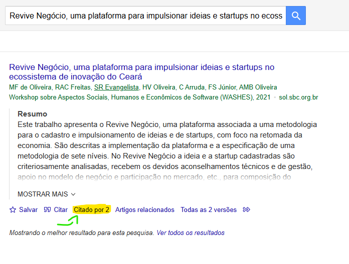
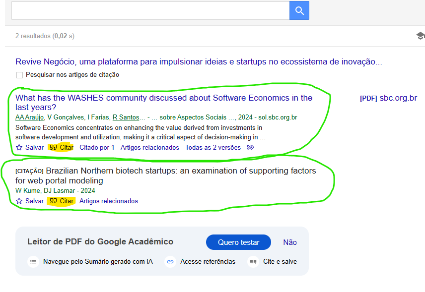
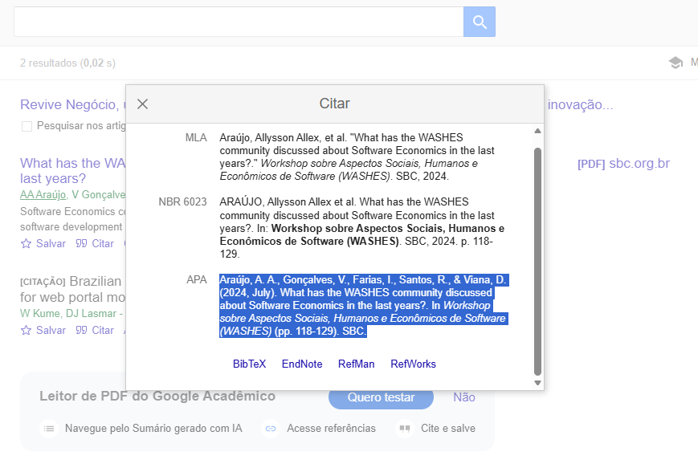
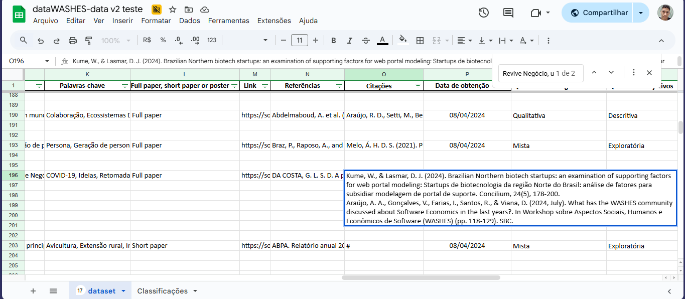
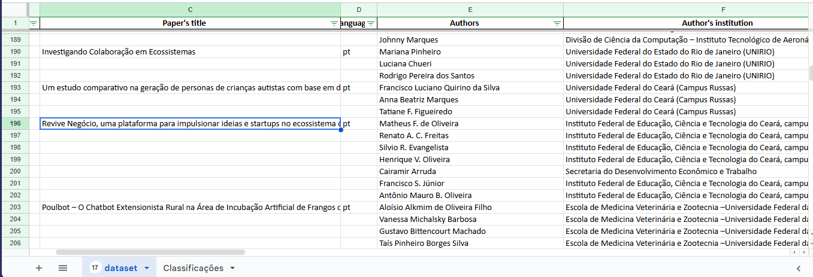

# Atualização dos dados

Atualmente, o WASHES é um evento anual. A cada nova edição do evento, novos artigos são publicados e precisam ser analisados e inseridos no dataset do projeto.

- [Link para os anais do WASHES](https://sol.sbc.org.br/index.php/washes/issue/archive)

No projeto, existem quatro arquivos JSON que servem como base de dados. Sempre que uma nova edição do WASHES ocorre, eles devem ser atualizados. São eles:

- [papers.json](../../data/papers.json)
- [editions.json](../../data/editions.json)
- [authors.json](../../data/authors.json)
- [award_papers.json](../../data/award_papers.json)

O processo de atualização desses dados segue os seguintes passos:

1. Acessar os anais da nova edição do WASHES;
2. A partir dos dados de cada artigo, atualizar a planilha onde ficam acumulados todos os dados. **IMPORTANTE:** deve-se seguir os padrões de preenchimento (por exemplo, usar `#` para sinalizar que um campo não possui dados);
3. Levar a planilha atualizada para o caminho `data/JSON Generator`;
4. Executar o script [data/JSON Generator/authorsJSON.py](../../data/JSON%20Generator/authorsJSON.py) para gerar um novo arquivo JSON de autores;
5. Executar o script [data/JSON Generator/papersJSON.py](../../data/JSON%20Generator/papersJSON.py) para gerar um novo arquivo JSON de artigos;
6. Ajustar as formatações dos JSONs gerados:
   - No diretório `data/JSON Generator/` há um arquivo de [instruções](../../data/JSON%20Generator/instruções.md) com mais detalhes sobre a execução dos scripts e as ferramentas utilizadas para formatar os arquivos JSON gerados;
7. Substituir os arquivos `authors.json` e `papers.json` pelos novos arquivos gerados pelos scripts;
8. Atualizar manualmente o arquivo `editions.json`, adicionando a nova edição;
9. Atualizar manualmente o arquivo `award_papers.json` com as informações dos artigos premiados;
10. Realizar o deploy das mudanças.

## Artigos

Um artigo possui os seguintes campos:

- **Paper_id**: Identificador único do artigo no sistema.
- **Title**: Título completo do artigo.
- **Language**: Idioma em que o artigo foi escrito.
- **Year**: Ano de publicação.
- **Abstract**: Resumo do artigo em inglês.
- **Resumo**: Resumo do artigo em português.
- **Keywords**: Palavras-chave que descrevem os principais temas do artigo.
- **Type**: Tipo de publicação (ex.: Full paper, Short paper).
- **Download_link**: Link para acesso ou download do artigo completo.
- **References**: Lista de referências bibliográficas citadas no artigo.
- **Cited_by**: Lista de trabalhos que citam este artigo.
- **Updated_in**: Data da última atualização do registro.
- **Authors**: Lista de autores do artigo.
- **Approach**: Abordagem metodológica da pesquisa.
- **Objective**: Objetivo principal do estudo.
- **Procedures**: Procedimentos metodológicos adotados.
- **Data_collection**: Forma como os dados foram coletados.
- **Quantitative_Data_Analysis**: Métodos de análise quantitativa dos dados.
- **Qualitative_Data_Analysis**: Métodos de análise qualitativa dos dados.

Quando uma nova edição do WASHES é lançada, a maioria dos dados que precisam ser coletados sobre os artigos está disponível na página dos anais daquela edição. A maioria dos campos pode ser atualizada a partir das informações encontradas no site, exceto:

- **Paper_id**: esse campo é gerado automaticamente pelo script `papersJSON.py`;
- **Cited_by**: esse campo é atualizado manualmente a partir do [Google Acadêmico](https://scholar.google.com/);
- Os campos **Approach** (Quanto à abordagem), **Objective** (Quanto aos objetivos), **Procedures** (Quanto aos procedimentos), **Data_collection** (Método para coleta de dados), **Quantitative_Data_Analysis** (Método para análise de dados quantitativos) e **Qualitative_Data_Analysis** (Método para análise de dados qualitativos) são preenchidos com a categoria mais adequada para o artigo. Isso é feito manualmente, a partir do julgamento de quem está atualizando os dados. Como se tratam de categorias, ao preencher esses campos, deve-se atentar para a escrita exata de cada categoria, conforme utilizada anteriormente, e apenas adicionar uma nova categoria se realmente for necessário.

**Obs.:** O campo **Referências** na planilha deve conter todas as referências usadas no artigo, com uma linha em branco entre cada referência. Já no campo **Citações**, essa linha em branco não é utilizada; apenas garanta que cada citação esteja em uma única linha.

### Citações

Caso ainda esteja sendo utilizado o método manual para preencher este campo, siga os passos abaixo:

1. Pesquisar o artigo pelo título no [Google Acadêmico](https://scholar.google.com/).

2. Se houver a opção **"Citado por X"**, clique nela, pois o artigo possui citações. Caso contrário, o artigo não possui citações, e o campo pode ser preenchido com `#`.

3. Como mostrado na imagem, o exemplo possui duas citações. Para cada citação, clique na opção **"Citar"**.

4. Um pop-up será aberto com algumas opções de citação. A opção a ser escolhida é o padrão **"APA"**. Copie a citação e cole na planilha.

5. Após repetir o processo para todas as citações, a planilha deve estar no seguinte formato:

## Autor

Um autor possui os seguintes campos:

- **Author_id**: Identificador único do autor no sistema.
- **Name**: Nome completo do autor.
- **Institution**: Nome completo da instituição à qual o autor está vinculado.
- **Institution_acronym**: Sigla da instituição do autor.
- **State**: Estado brasileiro da instituição.
- **Papers**: Lista de identificadores (**Paper_id**) dos artigos associados a este autor.

Os campos **Author_id** e **Papers** são gerados automaticamente pelo script `authorsJSON.py`.  
Os demais campos são preenchidos a partir dos dados inseridos na planilha.

Observe a forma de preenchimento da planilha:  
na **primeira linha de cada artigo**, devem ser informados os dados do **primeiro autor**.  
As informações dos **demais autores** devem ser preenchidas nas linhas seguintes. Nessas linhas, os campos relacionados ao artigo devem permanecer em branco.

As informações dos autores podem ser facilmente encontradas nos anais da edição, mais especificamente na página individual de cada artigo.

## Edições

A atualização do arquivo `editions.json` pode ser feita manualmente. Para isso, basta adicionar um novo objeto à lista e preenchê-lo com os dados da nova edição.

Uma edição possui os seguintes campos:

- **Edition_id**: Identificador único da edição no sistema.
- **Year**: Ano em que a edição do evento ocorreu.
- **Title**: Título completo dos anais da edição.
- **Location**: Local (cidade e estado) onde o evento foi realizado.
- **Date**: Data de realização do evento.
- **Proceedings**: Link para a página oficial dos anais da edição.
- **Chairs**: Lista de coordenadores(as) da edição do evento.
  - **Chairs.Name**: Nome completo do chair.
  - **Chairs.Instituition**: Instituição de vínculo do chair.
  - **Chairs.State**: Estado brasileiro da instituição do chair.
- **Papers**: Lista de identificadores (**Paper_id**) dos artigos publicados na edição.

Além do site dos anais do evento, cada edição costuma possuir um site próprio, no qual é possível obter informações como coordenadores, local e data do evento.

Para o preenchimento do campo **Papers**, é importante notar que a atribuição dos identificadores dos artigos é feita de forma **sequencial**, o que facilita esse processo.

## Artigos Premiados

Os objetos do arquivos `award_papers.json` são cópias dos objetos de `papers.json`, onde alguns campos foram removidos e um novo campo adicionado.Um artigo premiado possui os seguintes campos:

- **Paper_id**: Identificador único do artigo no sistema, correspondente ao mesmo identificador usado em `papers.json`.
- **Award**: Classificação ou premiação recebida pelo artigo (ex.: 1º Lugar, 2º Lugar, 3º Lugar).
- **Title**: Título completo do artigo.
- **Language**: Idioma em que o artigo foi escrito.
- **Year**: Ano de publicação do artigo.
- **Type**: Tipo de publicação (ex.: Full paper, Short paper).
- **Download_link**: Link para acesso ou download do artigo completo.
- **Authors**: Lista de autores do artigo premiado.
  - **Authors.Name**: Nome completo do autor.
  - **Authors.Institution**: Instituição à qual o autor está vinculado.
  - **Authors.Institution_acronym**: Sigla da instituição do autor.
  - **Authors.State**: Estado brasileiro da instituição.
  - **Authors.Author_id**: Identificador único do autor no sistema.

Geralmete estes artigos premiados são divulgados na página de instagran do WASHES.
