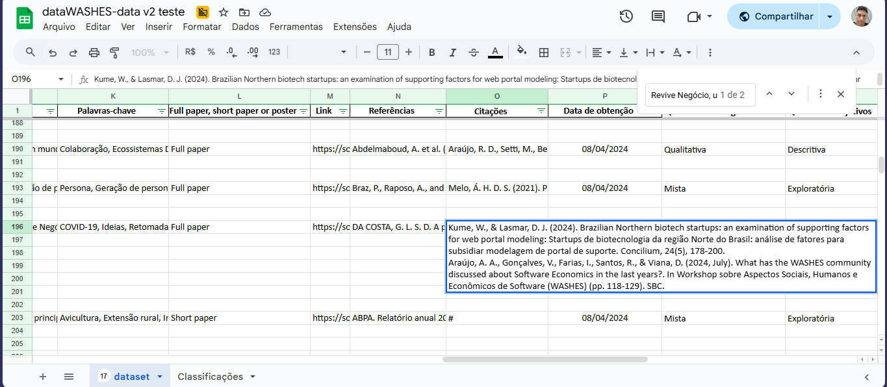
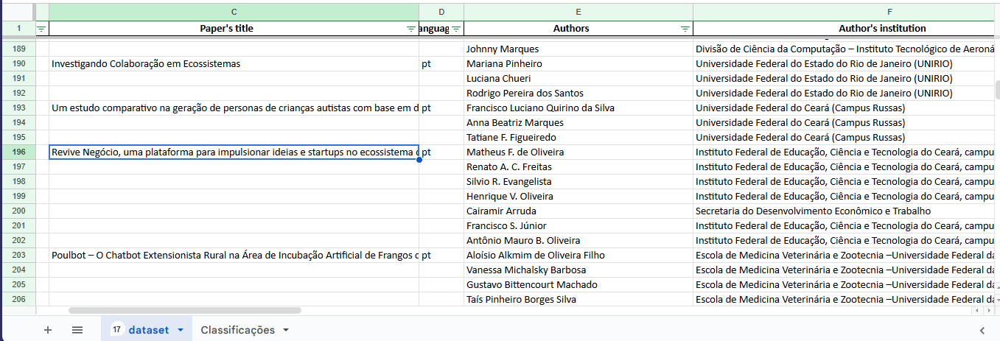

# 🔄 Atualização dos dados

Atualmente, o WASHES é um evento anual. A cada nova edição do evento, novos artigos são publicados e precisam ser analisados e inseridos no dataset do projeto.

- [Link para os anais do WASHES](https://sol.sbc.org.br/index.php/washes/issue/archive)

No projeto, existem quatro arquivos JSON que servem como base de dados. Sempre que uma nova edição do WASHES ocorre, eles devem ser atualizados. São eles:

- [papers.json](../../data/papers.json)
- [editions.json](../../data/editions.json)
- [authors.json](../../data/authors.json)
- [award_papers.json](../../data/award_papers.json)

---

## 🏗️ Arquitetura de Ingestão de Dados

O **dataWASHES** é 100% autônomo: um pipeline construído com **GitHub Actions, Python e IA** mantém a base de dados sem intervenção manual. A fonte oficial da verdade reside diretamente no repositório, na planilha `data/JSON Generator/dataWASHES-data.xlsx`, da qual todos os arquivos JSON são regenerados.

O pipeline é composto por três etapas automatizadas:

### 1. Scraping autônomo no SOL SBC (`scripts/sync_washes_dataset.py`)
O script acessa o [arquivo de edições do WASHES no SOL SBC](https://sol.sbc.org.br/index.php/washes/issue/archive), detecta se existe uma edição ainda não registrada no dataset e, se houver, extrai automaticamente os metadados completos de cada artigo: título, resumos (EN/PT), palavras-chave, autores, afiliações, tipo de publicação e link de download.

### 2. Classificação metodológica por IA (Groq — Llama-3.3 70B)
Para cada artigo novo, o `sync_washes_dataset.py` envia título, resumo e palavras-chave à API do **Groq**, utilizando o modelo **Llama-3.3 70B (`llama-3.3-70b-versatile`)** em modo JSON estruturado. A IA lê o conteúdo e classifica automaticamente os **6 campos metodológicos**: `Approach`, `Objective`, `Procedures`, `Data_collection`, `Quantitative_Data_Analysis` e `Qualitative_Data_Analysis`. O resultado é gravado na planilha `.xlsx`.

### 3. Mineração de citações no Google Scholar (`scripts/miner_citations.py`)
O minerador consulta o Google Scholar via **ScraperAPI** (contornando bloqueios de rate-limit) para obter as citações reais (`Cited_by`) e a referência APA de cada artigo pendente, atualizando a planilha.

---

## ⚡ Fluxo de Atualização Automatizado (CI/CD)

Todo dia 1º de cada mês (03:00 UTC), o workflow [`data-sync-and-citations.yml`](../../.github/workflows/data-sync-and-citations.yml) do GitHub Actions executa automaticamente a seguinte rotina:
1. **Scraping:** executa `scripts/sync_washes_dataset.py`, que verifica se há uma nova edição do WASHES no SOL SBC. Se houver, baixa todos os metadados de artigos, resumos, autores e afiliações.
2. **Inteligência Artificial:** utiliza a API do **Groq (Llama-3.3 70B)** para ler os resumos e classificar automaticamente os 6 campos metodológicos dos artigos.
3. **Citações:** executa `scripts/miner_citations.py` via **ScraperAPI** para buscar citações reais no Google Scholar.
4. **Pull Request:** atualiza a planilha `.xlsx`, regera os arquivos JSON e **abre um Pull Request (PR) automático** no GitHub (branch `auto-data-sync`) para revisão dos mantenedores.

> O workflow também pode ser disparado manualmente pela aba **Actions → Automatic Dataset Sync & Citation Miner → Run workflow**.

### 🧑‍💻 O Papel do Mantenedor:
Quando o robô abrir o Pull Request:
1. Acesse a branch criada pelo bot (`auto-data-sync`).
2. Abra a planilha `dataWASHES-data.xlsx` e **revise as colunas metodológicas** classificadas pela IA, ajustando se necessário.
3. Se houver artigos premiados na edição (divulgados no Instagram/site do evento), atualize manualmente o arquivo `award_papers.json`.
4. Aprove o Pull Request (Merge para a `main`).
5. Faça o [Deploy no PythonAnywhere](deploy.md).

---

## 💻 Execução Manual Local (Avançado)

Caso o mantenedor deseje forçar a atualização rodando os scripts localmente, é necessário configurar um arquivo `.env` na raiz do projeto com as chaves:
```env
GROQ_API_KEY=sua_chave_do_groq
SCRAPER_API_KEY=sua_chave_da_scraperapi
```

Em seguida, execute os scripts:
```bash
# 1. Busca novas edições, usa a IA para classificar, atualiza a planilha e regera os JSONs
python scripts/sync_washes_dataset.py

# 2. Atualiza as citações dos artigos pendentes via Google Scholar
python scripts/miner_citations.py
```

---

## 📄 Estrutura dos Dados

### Artigos (`papers.json`)

Um artigo possui os seguintes campos:
- **Paper_id**: Identificador único numérico gerado automaticamente.
- **Title**: Título completo do artigo.
- **Language**: Idioma em que o artigo foi escrito.
- **Year**: Ano de publicação.
- **Abstract**: Resumo do artigo em inglês.
- **Resumo**: Resumo do artigo em português.
- **Keywords**: Palavras-chave do artigo.
- **Type**: Tipo de publicação (`Full paper`, `Short paper`, `Poster`).
- **Download_link**: Link oficial para o artigo no SOL SBC.
- **References**: Lista de referências bibliográficas (com `#` se vazio).
- **Cited_by**: Citações obtidas automaticamente via Google Scholar.
- **Updated_in**: Data da última atualização.
- **Authors**: Lista de autores do artigo.
- **Approach**: Abordagem metodológica (`Qualitativa`, `Quantitativa`, `Mista`).
- **Objective**: Objetivo principal (`Exploratória`, `Descritiva`, `Explicativa`).
- **Procedures**: Procedimentos (`Estudo de caso`, `Survey`, `Revisão de literatura`, etc.).
- **Data_collection**: Método de coleta (`Questionário`, `Entrevista`, `Observação`, etc.).
- **Quantitative_Data_Analysis**: Métodos quantitativos (`Estatística descritiva`, etc.).
- **Qualitative_Data_Analysis**: Métodos qualitativos (`Análise de conteúdo`, `Análise temática`, etc.).

> **Nota:** Todos os campos acima, incluindo a classificação metodológica, são atualmente pré-preenchidos de forma autônoma pela IA. O papel do mantenedor é apenas **revisar** a classificação gerada no Excel.

### Citações
O preenchimento das citações (`Cited_by`) é automatizado pelo script `scripts/miner_citations.py`. Contudo, caso o robô falhe ou o mantenedor precise fazer uma correção manual legada:
1. Pesquise o artigo pelo título no [Google Acadêmico](https://scholar.google.com/).
2. Clique na opção **"Citado por X"**.
3. Clique em **"Citar"** para cada trabalho, copie no padrão **"APA"** e cole na planilha.



### Autor (`authors.json`)

Um autor possui os seguintes campos:
- **Author_id**: Identificador único do autor no sistema.
- **Name**: Nome completo do autor.
- **Institution**: Nome completo da instituição à qual o autor está vinculado.
- **Institution_acronym**: Sigla da instituição do autor.
- **State**: Estado brasileiro da instituição (inferido automaticamente).
- **Papers**: Lista de identificadores (**Paper_id**) dos artigos associados a este autor.

Observe a forma de organização na planilha: na **primeira linha de cada artigo**, são informados os dados do artigo e do **primeiro autor**. Os **demais autores** são preenchidos nas linhas seguintes, deixando os campos relacionados ao artigo em branco.



### Edições (`editions.json`)

A atualização do arquivo `editions.json` é feita automaticamente pelo `sync_washes_dataset.py`, que calcula a sequência de `Paper_id`s. Uma edição possui:
- **Edition_id**: Identificador único numérico da edição.
- **Year**: Ano em que a edição do evento ocorreu.
- **Title**: Título completo dos anais da edição.
- **Location**: Local (cidade e estado) onde o evento foi realizado.
- **Date**: Data de publicação.
- **Proceedings**: Link para a página oficial dos anais da edição.
- **Chairs**: Lista de coordenadores(as) da edição.
- **Papers**: Lista de identificadores (**Paper_id**) dos artigos publicados.

### Artigos Premiados (`award_papers.json`)

Os objetos do arquivo `award_papers.json` são cópias dos objetos de `papers.json`, onde alguns campos foram removidos e o campo **Award** (Classificação/Premiação: ex. 1º Lugar, 2º Lugar) foi adicionado.

Geralmente, os artigos premiados são divulgados na página de Instagram do WASHES ou em anúncios da coordenação durante o evento. Esta é a única etapa que **permanece estritamente manual**, devendo o mantenedor editar o arquivo `award_papers.json` caso haja premiações no ano vigente.